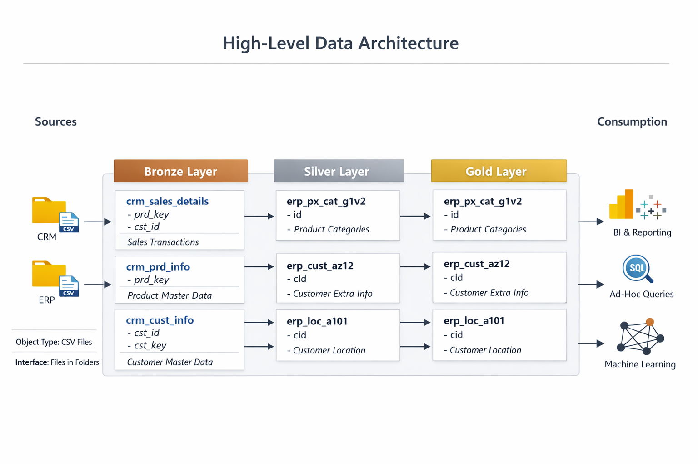
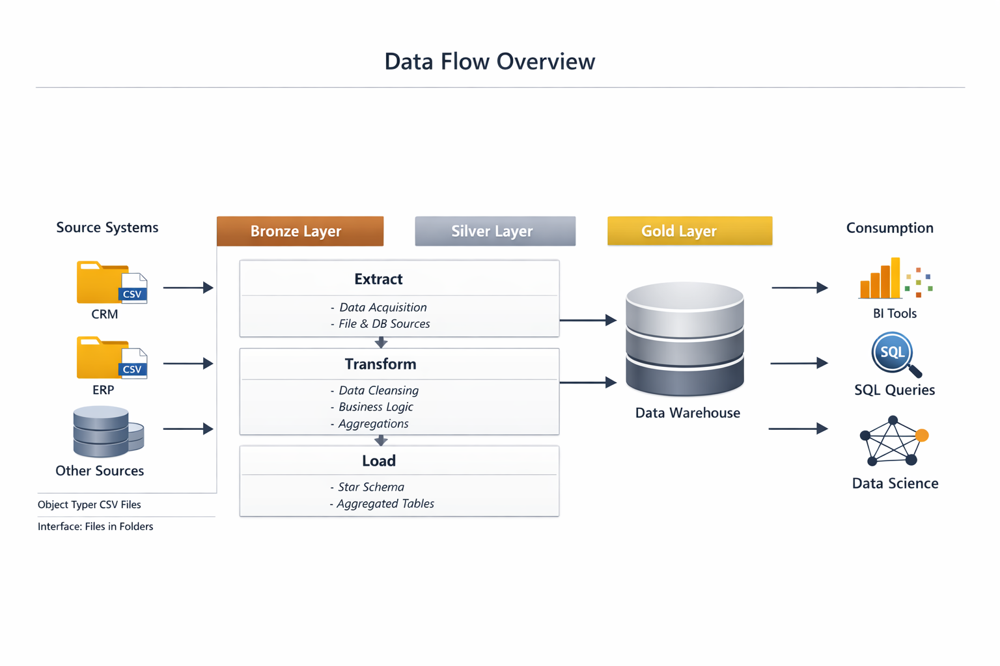
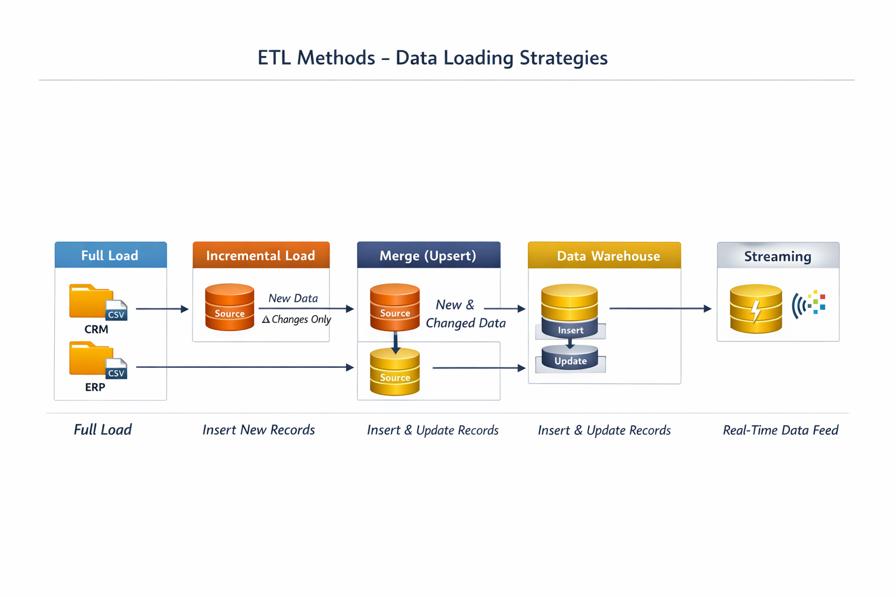
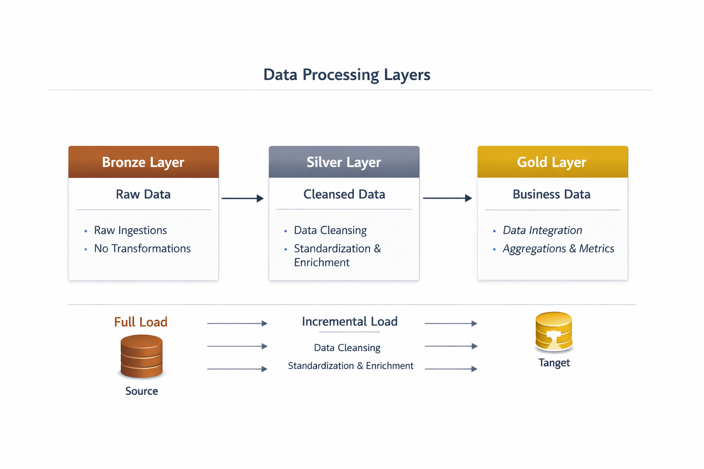
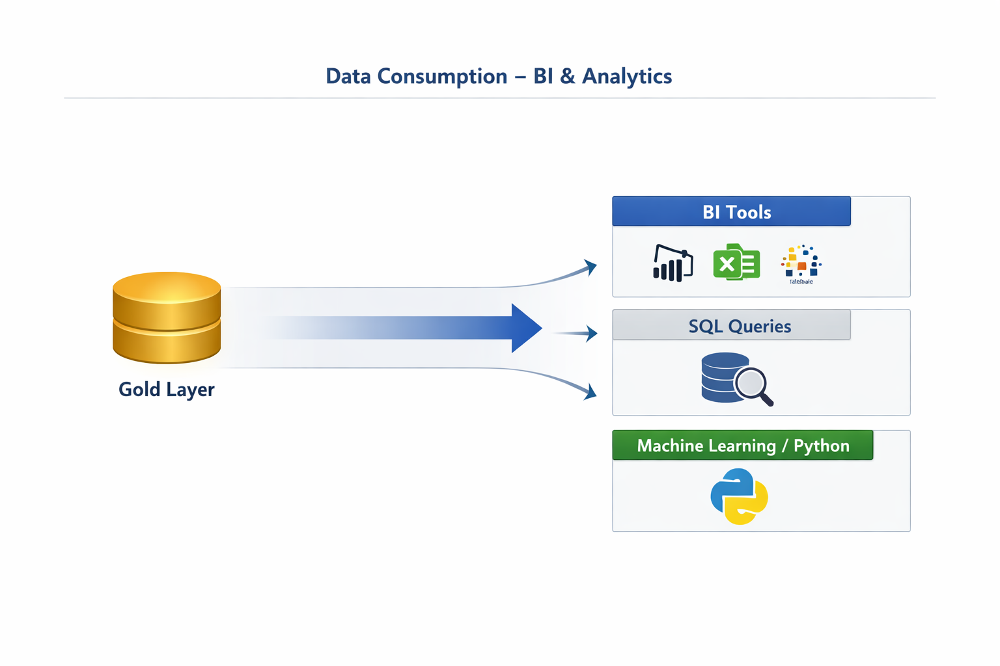

# SQL Data Warehouse Project (Medallion Architecture)

Hey, I’m **Amir** — a pharmacist transitioning into **Data Analysis**, building real end‑to‑end projects to strengthen my skills in **SQL, ETL, data engineering, and analytics**.

This repository showcases my work in designing and implementing a complete **SQL Data Warehouse** using the **Medallion Architecture (Bronze → Silver → Gold)**, with a focus on clean pipelines, structured modeling, and analytical reporting.

---

## 👨‍💻 About Me

I’m **Amir**, originally a pharmacist, and I’m just starting to shift my career into **Data Analysis**.  
I’m learning step-by-step and building practical projects to grow my skills in SQL, data cleaning, ETL, and analytical workflows.

---

## 🏗️ End‑to‑End Data Architecture

Below are the diagrams used throughout the project:

### **1️⃣ Data Integration Diagram**


### **2️⃣ High‑Level Architecture**


### **3️⃣ Data Flow Lineage**


### **4️⃣ ETL Methods Overview**


### **5️⃣ Bronze / Silver / Gold Layers**


### **6️⃣ Data Consumption (BI & Analytics)**


---

## 🟫 Bronze Layer — Raw Data

The Bronze layer stores raw data exactly as received from the source systems (CSV files).  
No cleaning or transformations are applied at this stage.

**Includes:**
- Raw CRM data  
- Raw ERP data  
- Initial ingestion scripts  

---

## 🥈 Silver Layer — Cleaned & Standardized Data

This layer applies all data quality steps to prepare the data for modeling.

**Processes include:**
- Data type corrections  
- Duplicate removal  
- Missing value handling  
- Outlier treatment  
- Standardization & normalization  

---

## 🥇 Gold Layer — Business‑Ready Data

The Gold layer contains the final analytical model.

**Includes:**
- Fact tables  
- Dimension tables  
- KPIs & metrics  
- Aggregated analytical views  

---

## 📊 Project Goals

- Build a structured SQL‑based data warehouse  
- Apply Medallion Architecture in a real project  
- Practice ETL logic using SQL  
- Design a clean star schema for analytics  
- Develop SQL queries for insights and reporting  

---

## 🛠️ Tools & Technologies

- SQL Server  
- SQL Server Management Studio (SSMS)  
- Git & GitHub  
- DrawIO (for diagrams)  

---

## 📂 Repository Structure

```
data-warehouse-project/
│
├── datasets/          # Raw CSV files
├── docs/              # Architecture diagrams and documentation
├── scripts/           # SQL scripts for Bronze, Silver, and Gold layers
├── tests/             # Data quality checks
└── README.md          # Project overview
```

---

## 📌 Project Status

This is my working version of the project.  
I will continue updating the repository as I progress through each layer and add more documentation, diagrams, and SQL scripts.

---

## 📬 Connect With Me

<p align="left">
  <a href="https://www.linkedin.com/in/amir-ayman-664513103/" target="_blank">
    
  </a>

  <a href="https://github.com/amirayman20" target="_blank">
    
  </a>

  <a href="mailto:amirayman20@gmail.com" target="_blank">
    
  </a>
</p>
